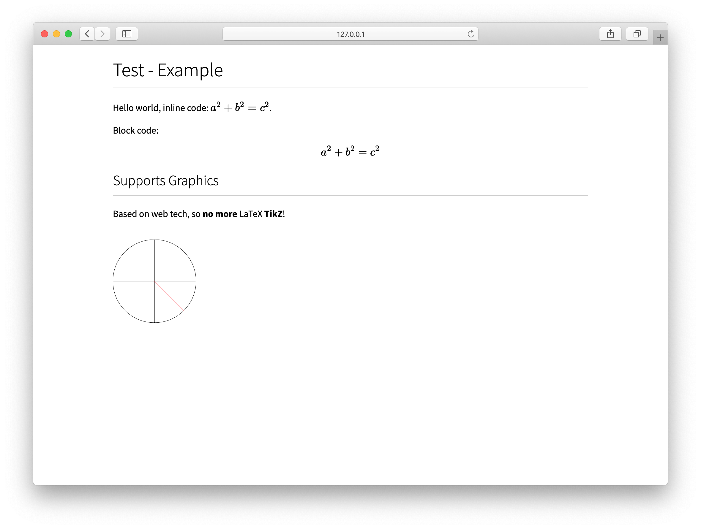
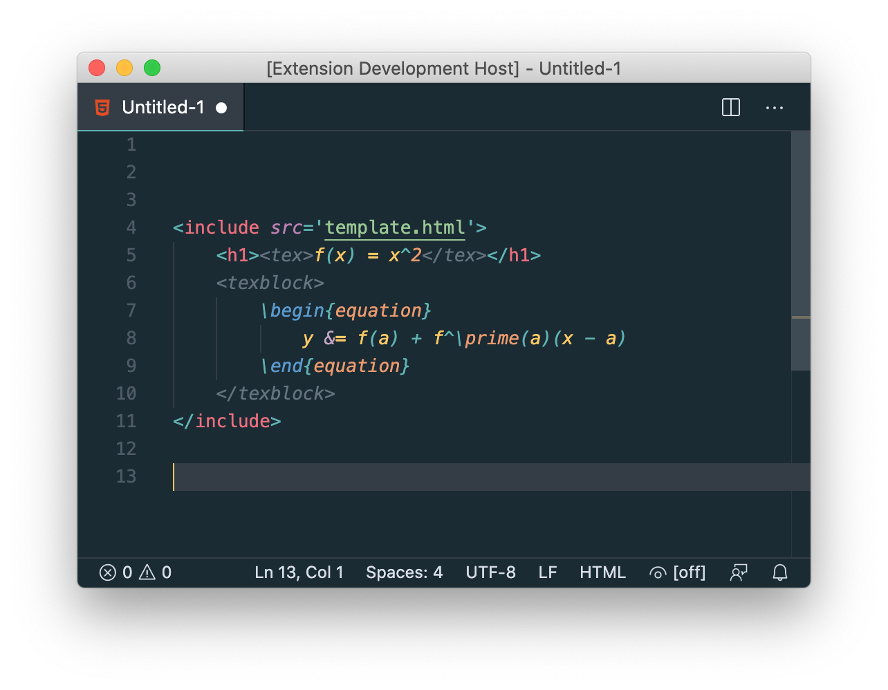
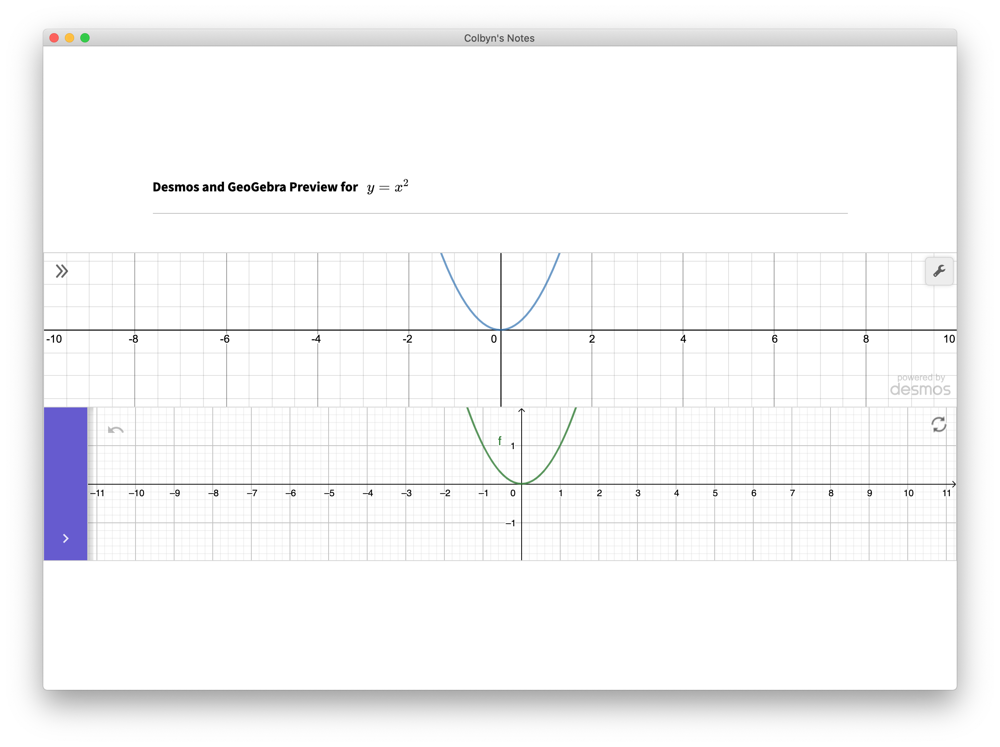
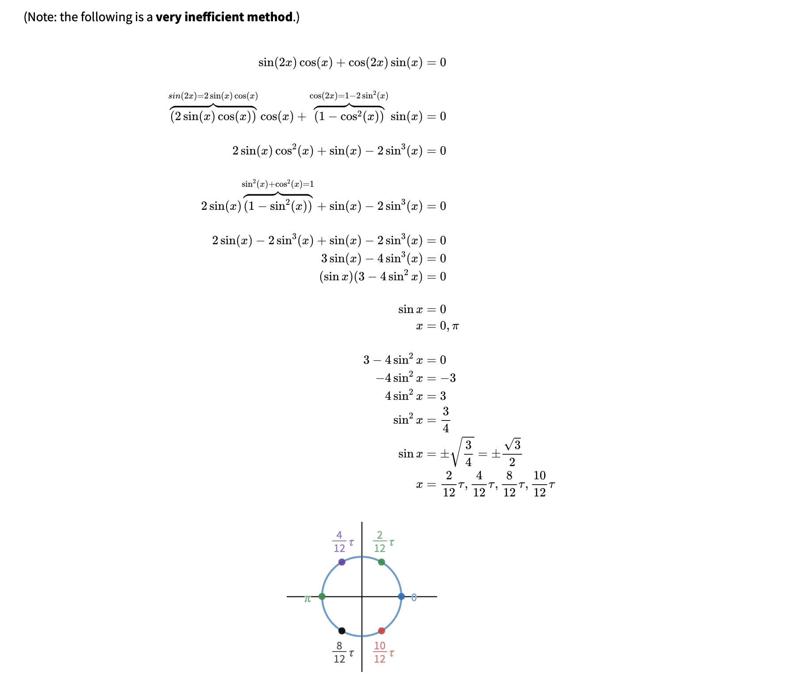

# Subscript - Publishing using Web Technologies

> Note, originally Subscript referred to a frontend UI framework, but that has been abandoned, I’m recycling the old Subscript name for a new project. The old project can be found here [colbyn/subscript-old](https://github.com/colbyn/subscript-old).


## High Level TODO:

- [CSS Paged Media](https://www.w3.org/TR/css-page-3/): support traditional print use cases, or just rendering to a PDF. This is what I am currently planning on using for rendering to e.g. PDFs: [PagedJS](https://www.pagedjs.org)

## Preview



Comes with a syntax highlighting extension for VS Code.



It injects the LaTeX grammar from [latex-workshop](https://marketplace.visualstudio.com/items?itemName=James-Yu.latex-workshop) into the `<tex>` and `<texblock>` html tags. 

## Macros

Versatility in Subscript is made possible VIA macros (the syntax is akin to web components, but it's expanded out at compile time compared to runtime, i.e. a macro).

For example, to display math formulas, you may use the `<tex>` macro, to plot `y = x^2`, you may use e.g. the `<desmos>` macro, and etc. Furthermore, say you wanted to publish content with music notation, you could create a macro that provides a high level interface to e.g. [VexFlow](https://www.vexflow.com/). 

For now, all supported macros are implemented in the core compiler.

Long term wise, I'd like to move away from the current monolithic architecture, and support extensibility in a more general manner VIA some scripting language. For this, I plan on embedding [Deno](https://github.com/denoland/deno), which will provide a multitude of benefits that e.g. NodeJS can't offer (Deno is from the creator of NodeJS).


## Cool Features (Using Macros)

### Graphing VIA Desmos/GeoGebra

> Still being copied over from the original ad-hoc implementation ([over here](https://github.com/colbyn/school-notes)). I think the API can be cleaned up a bit as well, for instance, I think grid lines should be disabled by default.

```html
<desmos height="200px">
    <expr>y=x^2</expr>
</desmos>
<geogebra height='200' type='graphing'>
    <expr>y=x^2</expr>
</geogebra>
```



Which is customizable (see the bottom figure):


